************************************************
The Cascade information reconciliation protocol.
************************************************

Tutorial by `Bruno Rijsman <https://www.linkedin.com/in/brunorijsman/>`_

Quantum key distribution (QKD) protocols.
=========================================

All quantum key distribution (QKD) protocols involve using a combination of quantum communications (qubits) and classical communications (classical bits) to allow two parties Alice and Bob to agree on a secret key in such a way that our nefarious eavesdropper Eve cannot observe what the secret key is without being detected by Alice and Bob.

.. image:: figures/qkd-alice-bob-eve.png
    :align: center
    :alt: Quantum key distribution protocol

There are multiple quantum key distribution protocols, including for example BB84 and B92. All of these protocols consist of both a quantum phase and a classical post-processing phase.

The quantum phase uses both the quantum channel and the classical channel to actually exchange the key.

The classical post-processing phase only uses the classical channel. The classical post-processing phase is further sub-divided into two parts:

* Information reconciliation, which is responsible for detecting and correcting inevitable bit errors (noise) in the key that was exchanged during the quantum phase.

* Privacy enhancement, which is responsible for mitigating the information leakage during the information reconciliation step.

In this document we only discuss one specific information reconciliation protocol, namely the Cascade protocol.

We won't discuss privacy enhancement nor the quantum phase. Those interested in more details on the quantum phase can have a look at our `simulaqron-bb84-python <https://github.com/brunorijsman/simulaqron-bb84-python>`_ GitHub repository that contains our Python implementation of the quantum phase in the BB84 quantum key distribution protocol.

Key bit errors (noise).
=======================

Key distribution protocols always introduce some noise in the key. The key that Bob receives contains some noise (i.e. bit errors) as compared to the key that Alice sent. For that reason we refer to the key that Alice sent as the correct key and to the key that Bob received as the noisy key.

.. image:: figures/correct-key-noisy-key.png
    :align: center
    :alt: Alice's correct key and Bob's noisy key

The noise can be introduced by imperfections in the hardware and by random fluctuations in the environment. Or the noise can be introduced by eavesdropper Eve observing traffic. Remember: in quantum mechanics observing a photon causes the photon to change and hence introduces detectable noise.

All quantum key distribution protocols provide an estimate of the noise level in the form of an estimated bit error rate. Bit error rate 0.0 means that no key bits have been flipped and bit error rate 1.0 means that all key bits have been flipped.

Classical post-processing.
==========================

If the estimated bit error rate is above some threshold we conclude that Eve is observing the traffic trying to determine the secret key. In that case, we abandon the key distribution attempt.

If the estimated bit error rate is below the threshold we perform classical post-processing, which consist of the two steps that we mentioned earlier. Both of these steps are classical protocols in the sense that they only involve classical communications and not any quantum communications

.. image:: figures/qkd-phases-and-steps.png
    :align: center
    :alt: QKD phases and steps

Information reconciliation.
---------------------------

The first classical post-processing step is information reconciliation. Even if the bit error rate is below the threshold, it is not zero. There is still some noise: there are still bit errors in the noisy key that Bob received as compared to the correct key that Alice sent. The purpose of the information reconciliation step is to detect and correct these remaining bit errors.

There are multiple information reconciliation protocols. In this document we discuss only one specific protocol, namely the Cascade protocol.

The tricky part to information reconciliation is to avoid leaking (i.e. exposing) too much information about the key. Eve, the eavesdropper, can learn any information that we leak during the information reconciliation step. Even if she does not learn the entire key, learning any leaked partial information about the key simplifies her task of decrypting the encrypted traffic. Every bit of leaked key information halves the number of keys that Eve has to try during a brute force attack.

That said, it is unavoidable that the information reconciliation protocol leaks some limited amount of information. This is okay as long as the amount of leaked information is bounded and known, so that we can compensate for it.

Privacy amplification.
----------------------

The second classical post-processing step is privacy amplification. The purpose of privacy amplification is to compensate for the information leakage in the information reconciliation step. Privacy amplification introduces extra randomness at the cost of reducing the effective key size.

In this document we do not discuss privacy amplification any further.

The Cascade protocol.
=====================

The Cascade protocol is one example of an information reconciliation protocol. The purpose of the Cascade protocol is to detect and to correct any remaining bit errors in the noisy key that Bob received relative to the correct key that Alice sent.

Let's say that Alice and Bob are the two parties that have just run the quantum phase of a quantum key distribution such as BB84. Alice has the correct key and Bob has a noisy key, which is similar to Alice's correct key but which has some limited number of bit errors (i.e. noise). Alice and Bob will now run the Cascade protocol to detect and correct any remaining bit errors in the Bob's noisy key.

Cascade as a client-server protocol.
====================================

From a protocol point of view, it makes sense to describe the Cascade protocol in terms of a client-server protocol.

Bob takes the role of the client. As far as Cascade is concerned, he is the active party. He decides what needs to happen when. He does most of the computation. And he sends messages to Alice when he needs her to do something.

Alice takes the role of the server. As far as Cascade is concerned, her role is mostly passive. She waits for Bob to ask her simple questions and she provides the answers.

We will describe the Cascade protocol from the perspective of the client, i.e. from the perspective of Bob.

An interesting observation is that the Cascade protocol puts most of the complexity and most of the computational burden on the client. The server doesn't do much except compute simple parities when asked to do so by the client. This is a very nice property for a client-server protocol. The server could have many (thousands) of sessions to clients, so it is very desirable that each session is simple and light-weight. The client will typically have only a few sessions to a few servers, so it is okay if the sessions are more complex and heavy-weight.

It is fair to say that quantum key distribution is currently often (almost always, perhaps) used to secure point-to-point links with a quantum key distribution device on either end of the link. From that perspective it is natural to think of Cascade as a peer-to-peer protocol.

That said, quantum key distribution in general and Cascade in particular could very well be deployed in true client-server scenarios. One example scenario is secure web traffic where a web server (e.g. Apache) has many session to many different web clients (e.g. Chrome web browsers) using the HTTPS protocol.

.. image:: figures/peer-to-peer-vs-client-server.png
    :align: center
    :alt: Peer-to-peer versus client-server

The classical channel.
======================

Cascade is a fully classical protocol. It only involves the exchange of classical messages. It does not involve any quantum communications.

We assume that there is a classical channel between Alice and Bob that allows Alice and Bob to exchange classical messages as part of the Cascade protocol. We rely on classical techniques to provide reliability, flow-control, etc. (for example, we could use TCP/IP).

We do not require that the classical channel is encrypted: we assume that eavesdropper Eve can observe all classical messages in the clear.

Any requirement that the classical channel be encrypted would introduce a chicken-and-egg problem: we would need a quantum key distribution protocol to encrypt the classical channel, but the quantum key distribution protocol would need an encrypted classical channel.

We do, however, require that the classical channel provides authentication and integrity. We assume that there is a mechanism that allows Alice and Bob to verify that all classical messages were actually sent by Bob and Alice and have not been forged or tampered with by Eve.

This is needed to avoid woman-in-the-middle attacks by Eve, where Eve intercepts all classical traffic and pretends to be Bob to Alice and pretends to Alice to Bob.

We do not discuss how the authentication and integrity are implemented nor does the code in this repository contain any authentication or integrity mechanisms.

This is consistent with most of the literature on quantum key distribution. Most literature barely mentions the need for an authentication and integrity on the classical channel. Details on how to do it are even less forthcoming. This might give you the impression that it is a trivial matter not worth discussing. Nothing could be further from the truth!

Yes, it is true that authentication and integrity are considered to be well-solved problems for classical protocols. For authentication, classical protocols typically use either public key infrastructure (PKI) or pre-shared keys. For integrity, classical protocols typically use hash-based message authentication codes (HMAC) in combination with Diffie-Hellman or pre-shared keys to agree on the message authentication key.

But none of those options (pre-shared keys, public key infrastructure, Diffie-Hellman) are attractive options for quantum key distribution.

Public-key infrastructure and Diffie-Hellman are problematic because they are not quantum-safe: they rely on the assumption that factorization or modular logarithms are computationally difficult.

Pre-shared keys are somewhat acceptable for point-to-point connections, but they are really problematic in client-server scenarios where the server does not know a-priori which clients will connect to it. But more importantly, using pre-shared keys defeats the whole purpose of running a quantum key distribution protocol.

In summary: while the topic of authenticating the classical channel is usually glossed over, it is not at all obvious how to achieve it in the context of quantum key distribution.

Input and output of the Cascade protocol.
=========================================

Let's start by looking at the Cascade protocol as a black box algorithm, and let's consider what the input and the output of the Cascade protocol are.

.. image:: figures/input-and-output.png
    :align: center
    :alt: Cascade as a black box, input and output

Input: noisy key and estimated quantum bit error rate (QBER).
-------------------------------------------------------------

Bob initiates the Cascade protocol after the quantum phase of the quantum key distribution has been completed.

At this point, Bob has the following information available to him,  which is the input to the Cascade protocol.

Bob has the noisy key that he has received from Alice. Although a quantum key distribution protocol was used to agree on this key, there is nothing quantum about the key at this point. It is just a string of classical bits of a certain length (the key size).

As we described earlier, the quantum key distribution protocol introduces some noise when it delivers this key to Bob. Thus, Bob has a noisy key which has some bit errors compared to Alice's correct key.

Bob does not know exactly how many bit errors there are or which bits are in error, but the quantum key distribution protocol does provide an estimate of the bit error rate, which also known as the quantum bit error rate (QBER).

Thus, we have two inputs to the Cascade protocol: the noisy key and the estimated quantum bit error rate (QBER).

Output: reconciliated key and amount of leaked information.
-----------------------------------------------------------

Is the job of the Cascade protocol to determine which bits exactly are in error and to fix them.

It is important to understand that Cascade does not guarantee that all bit errors are corrected. In other words, Bob's reconciliated key is still not guaranteed to be the same as Alice's correct key. Even after the reconciliation is complete, there is still a remaining bit error rate. The remaining bit error rate is orders of magnitude smaller than the original bit error rate before Cascade was run. But it is not zero. That is why we prefer to use the term reconciliated key and not corrected key, although the latter is also often used.

Cascade per-se does not contain any mechanism to detect and report whether the reconciliation was successful. It will neither detect nor report that there are any remaining bit errors after reconciliation. Some mechanism outside of Cascade is needed to validate whether the reconciliated key is correct or not.

The Cascade protocol can also keep track of exactly how much information was leaked. Specifically, Cascade running at Bob can keep track of which parities he asked Alice to compute. We must assume that Eve will also know about those parities. We can express the amount of leaked information in terms of leaked key bits (this is a logical abstraction - it does not indicate which specific key bits were leaked, it only provides a measure of how much information was leaked).

The amount of leaked information may be used by the privacy amplification phase that runs after the information reconciliation phase to determine how much amplification is needed.

Thus, the output of Cascade are the reconciliated key and the amount of leaked information.

Cascade Iterations.
===================

Now we are ready to start describing the guts of the Cascade protocol, i.e. to describe in detail how it actually works.

Let's define a single run of the Cascade protocol as Alice and Bob reconciliating (i.e. attempting to correct) a single key.

A single Cascade run consists of multiple iterations (these are also known as passes). Different variations of the Cascade protocol use different numbers of iterations. But we start by describing the original version of the Cascade protocol which uses four iterations.

Each Cascade iteration corrects some of the bit errors in the key. It is very probable (but not entirely certain) that all bit errors will have been corrected by the end of the last iteration.

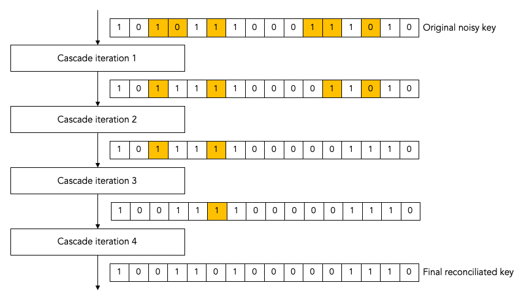

Note: for the sake of clarity, all of our diagrams show very small keys. In the above diagram, for example, we use 16-bit keys. In later diagrams we will use even smaller keys to make them fit in the diagram. In real life the keys can be much much larger: tens of thousands or even hundreds of thousands of bits.

Key shuffling.
==============

At the beginning of each iteration, except the first one, Bob randomly shuffles the bits in the noisy key. Shuffling means randomly reordering the bits in the key.

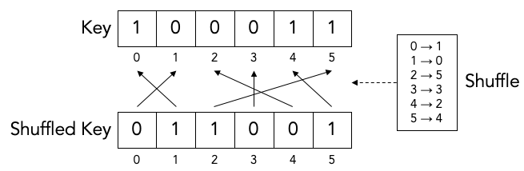

Later we will find out what the purpose of shuffling the key is. For now, we just point out that the shuffling is not intended to obfuscate the key for Eve. It is perfectly okay if the shuffling is only pseudo-random or even deterministic.

It is even okay if Eve knows what the shuffling permutation is (shown as the "Shuffle" in the above diagram) as long as the actual key values before ("Key") or after the shuffling ("Shuffled key") are not divulged. In fact, Bob needs to inform Alice what the shuffle permutation for each Cascade iteration is. It is no problem if the information about the shuffle permutation is sent in the clear and Eve can observe it.

As we mentioned, Bob re-shuffles his noisy key at the beginning of each iteration except the first one:

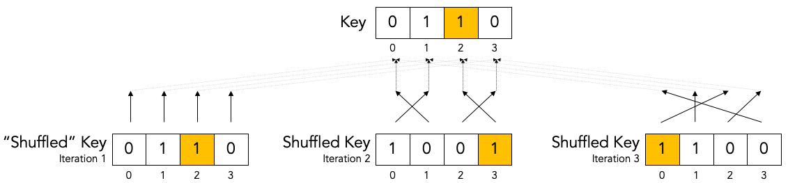

We put the word "shuffled" in quotes for the first iteration because they key is not really shuffled for the first iteration.

The important thing to observe is that any given bit in the original unshuffled key (for example bit number 2 which is marked in yellow) ends up in a different position in the shuffled key during each iteration.

Creation of the top-level blocks.
=================================

During each iteration, right after shuffling the key, Bob divides the shuffled key into equally sized blocks (the last block may be a smaller size if the key is not an exact multiple of the block size).

We will call these blocks top-level blocks to distinguish them from other types of blocks (the so-called sub-blocks) that will appear later in the protocol as a result of block splitting.

The size of the top-level blocks depends on two things:

* The iteration number :emphasis:`i`. Early iterations have smaller block sizes (and hence more blocks) than later iterations.

* The estimated quantum bit error rate :emphasis:`Q`. The higher the quantum bitter error rate, the smaller the block size.

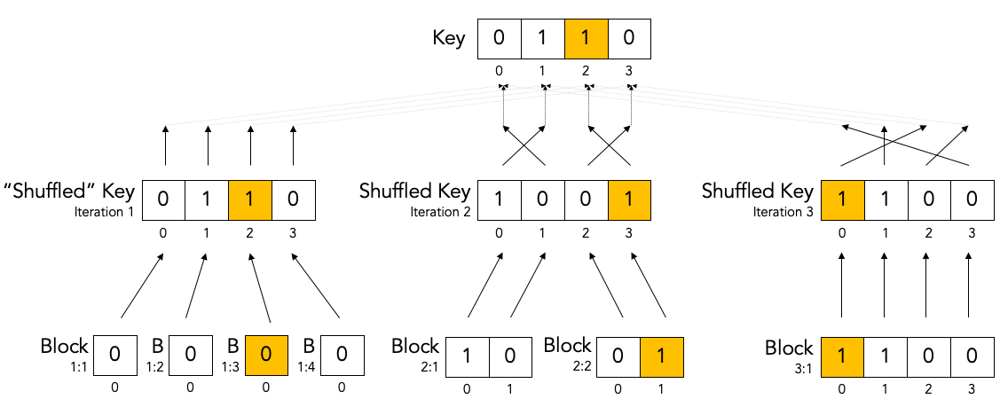

Note: to make things fit on a page the block sizes are extremely small in this diagram. In real life, top-level blocks are much larger. Specifically, we would never see a single-bit top-level block.

There are many variations of the Cascade protocol, and one of the main differences between these variations is the exact formula for the block size :emphasis:`k`\ :subscript:`i` as a function of the iteration number :emphasis:`i` and the quantum bit error rate :emphasis:`Q`.

For the original version of the Cascade protocol the formula is as follows:

:emphasis:`k`\ :subscript:`1`\ = 0.73 / :emphasis:`Q`

:emphasis:`k`\ :subscript:`2`\ = 2 * :emphasis:`k`\ :subscript:`1`

:emphasis:`k`\ :subscript:`3`\ = 2 * :emphasis:`k`\ :subscript:`2`

:emphasis:`k`\ :subscript:`4`\ = 2 * :emphasis:`k`\ :subscript:`3`

Without getting into the mathematical details behind this formula, we can build up some intuition about the reasons behind it.

Later on, we will see that Cascade is able to correct a single bit error in a block but is not able to correct a double bit error in a block.

If we pick a block size 1/:emphasis:`Q` for the first iteration, then each block will is expected to contain a single bit error on average. That is just the definition of bit error rate. If the bit error rate is 1 error per 100 bits, then a block of 100 bits will contain on average one error.

Now, if we use 0.73/:emphasis:`Q` instead of 1/:emphasis:`Q` then we will have slightly smaller blocks than that. As a result we will have more blocks with zero errors (which are harmless) and fewer blocks with two errors (which are bad because they cannot be corrected).

On the other hand, we don't want to make the blocks too small, because the smaller we make the blocks, the more information is leaked to Eve. Knowing the parity over more smaller blocks allows Eve know more about the key.

So, that explains the formula 0.73/:emphasis:`Q` for the first iteration. What about the doubling of the block size in each iteration?

Well, during each iteration Cascade corrects some number of errors. Thus the remaining quantum bit error rate for the next iteration is lower (i.e. fewer error bits). This allows us to use a bigger block size for the next iteration, and still have a low probability of two (uncorrectable) errors in a single block.

Detecting and correcting bit errors in each block.
==================================================

After having shuffled the key and after having split the key into blocks for a given iteration, Bob sets out on the task of determining, for each block, whether or not there are any bit errors in that block and, if so, to correct those bit errors.

The process of doing so is a bit complex because Bob needs to do it in such a way that he leaks a minimum of information to eavesdropper Eve who is watching his every move.

Computing the error parity for each top-level block: even or odd.
=================================================================

Computing the current parity.
-----------------------------

Bob locally computes the current parity of each top-level block. This is a parity over some subset of bits in the shuffled noisy key that Bob has received from Alice. In the following example, Bob computes the parity of the 2nd top-level block in the 2nd iteration. That block has value 01 so its current parity is 1.

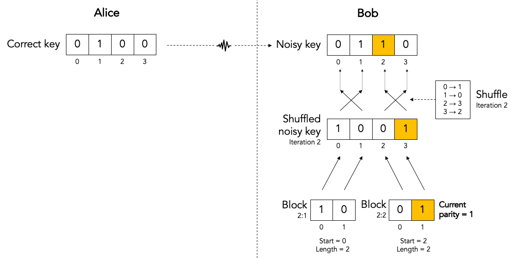

Computing the correct parity.
-----------------------------

Next, Bob wants to know Alice's perspective on the block parity. He already knows the "current parity" of the block in his own noisy key, but now he wants to know the "correct parity" of the same block in the Alice's correct key.

There is no way for Bob to compute the correct parity himself. Bob does not have access to the correct key, only Alice does. Actually, that statement is a little bit too strong. It turns out that there is an exception to this statement. Hold on until we discuss block parity inference (BPI) near the end of this tutorial.

The solution is simple: Bob simply sends an *ask parity* message to Alice. The purpose of this message is to ask Alice to compute the correct parity.

Let's first look at a very naive way of implementing the *ask parity* message, which is very inefficient but which makes the concept very clear:

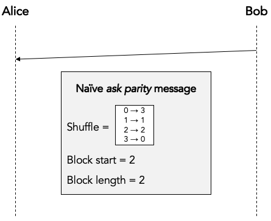

In this implementation Bob literally provides all the information that Alice needs to reconstruct the block and compute the correct parity:

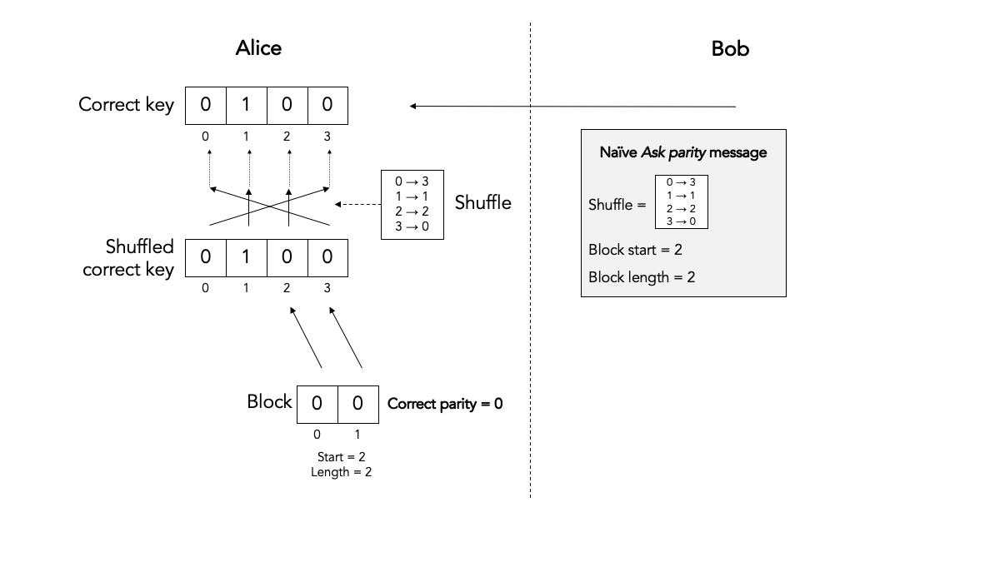

This is an inefficient way of computing the correct the parity. For one, the *ask shuffle* message can get very large because the shuffle permutation can get very large: here it is N numbers, where N is the key size (but it is easy to see that we could reduce N to the block size). Secondly, it requires Alice to spend processing time on reconstructing the shuffled key and the block.

An obvious optimization is for Bob to just cut to the chase and list the actual unshuffled key indexes over which Alice must compute the parity:

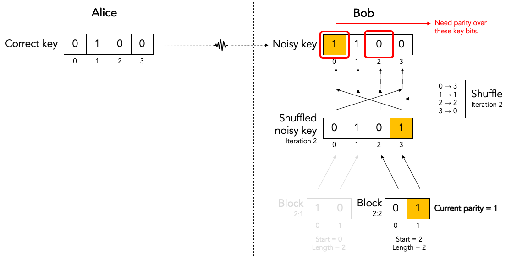

This allows Alice to just compute the correct parity without wasting CPU cyles on reconstructing the shuffled key and block:

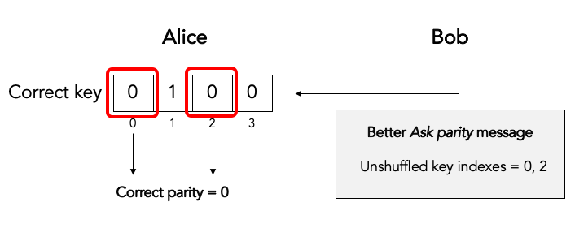

In both cases the *ask parity* message does not leak any information about the key (yet): it does not contain the value of any key bit or any other information about the key bits themselves.

It turns out that there are even more efficient ways of implementing the *ask parity* message. These rely on the fact that the key is only shuffled once per iteration and we ask for block parities many times per iteration. These optimizations are described in the `implementation guide <cascade_implementation>`_.

The only thing left to do is for Alice to send the correct parity back to Bob in a *reply parity* message:

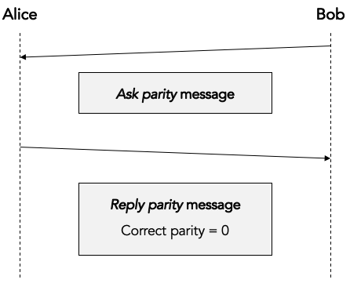

In any real implementation there would be additional fields in the *reply message* to associate the reply parity message with the corresponding ask parity message, but we gloss over those details here.

Although neither Alice nor Bob ever divulge any actual key bits, the divulgence of the correct parity in the *reply parity* message does leak a little bit of information to Eve. This is easy to understand if we look at the number of values Eve has to try out in a brute force attack. If Eve knows nothing about N bits, she has to try out 2N values in a brute force attack. But if she knows the parity of those N bits, she only has to try out 2N-1 values.

Inference the error parity from current parity and the correct parity.
----------------------------------------------------------------------

At this point Bob knows both the correct parity and the current parity of the block.

Can Bob determine which bits in the block are in error? Well, no, he cannot. Can Bob at least determine whether there are any errors in the block or not? Well, no, he cannot determine even that.

What can Bob determine then? Well, Bob can determine whether there are an even or an odd number of errors in the block (the so-called error parity), by using the following table:

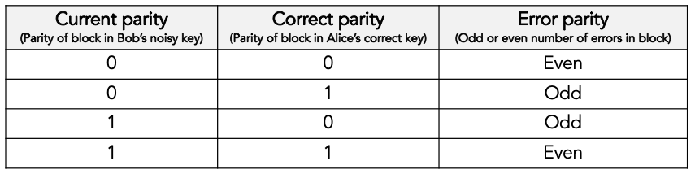

If the error parity is odd, then Bob knows that there is at least bit one error in the block. He doesn't know exactly how many bit errors there are: it could be 1 or 3 or 5 or 7 etc. And he certainly doesn't which which key bits are in error.

If the error parity is even, then Bob knows even less. Remember that zero is an even number. So, there could be no (zero) errors, or there could be some (2, 4, 6, etc.) errors.

Correcting a single bit error in top-level blocks with an odd number of bits.
=============================================================================

When Bob finds a block with an even number of errors, Bob does nothing with that block (for now).

But when Bob finds a block with an odd number of errors, Bob knows that there is at least one remaining bit error in the block. Bob doesn't know whether there is 1 or 3 or 5 etc. bit errors, but he does now there is at least one bit error and that the number is odd. For such a block, Bob executes the Binary algorithm. We will describe the Binary algorithm in the next section. For now, suffice it to say that the Binary algorithm finds and corrects exactly one bit error in the block.

Let's summarize what we have done so far.

In each iteration (except the first) Bob first shuffles the noisy key. Then he takes the shuffled key and breaks it up into blocks. Then he visits every block and determines the error parity for that block. If the error parity is even, he does nothing. If the error parity is odd, then he runs the Binary algorithm to correct exactly one bit errors.

So, at the end of the iteration, Bob ends up with a list of blocks that all have an even error parity.

Some blocks already had an even error parity at the beginning of the iteration and Bob did not touch them.

Some blocks had an odd error parity at the beginning of the iteration and Bob ran the Binary algorithm to correct exactly one bit error. If you start with a block with an odd number of bit errors, and you correct exactly one bit error, then you end up with a block with an even number of bit errors.

Does this mean that we have removed all errors during this iteration? No it does, not. We only know that each block now contains an even number of errors. It could be zero errors. But it could also be 2, 4, 6, etc. errors.

During this iterations there is nothing more Bob can do to find or correct those remaining errors. But that doesn't mean those remaining error won't get corrected. Later we will see how a combination of reshuffling in later iterations and the so-called cascading effect will (with high probability) find and correct those remaining errors.

The Binary algorithm.
=====================

The Binary algorithm takes as input a block that has an odd number of errors. It finds and corrects exactly one bit error.

Bob is only allowed to run the Binary algorithm on blocks that have an odd number of errors. Bob is not allowed to run the Binary algorithm on a block that has an even number of errors (it is a useful exercise to figure out why not).

Split block.
------------

The first thing Binary does is to split the block into two sub-blocks of equal size. We call these sub-blocks the left sub-block and the right sub-block. And we call the block that was split the parent block. If the parent block has an odd size, then the left sub-block is one bit bigger than the right sub-block.

Given the fact that we know for certain that the parent block has an odd number of errors, there are only two possibilities for the sub-blocks.

Either the left sub-block has an odd number of errors and the right sub-block has an even number of errors, as in the following examples:

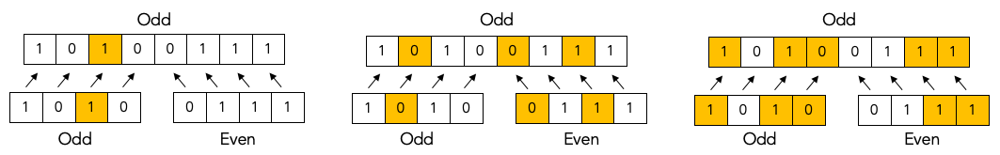

Or the left sub-block has an even number of errors and the right sub-block has an odd number of errors, as in the following examples:

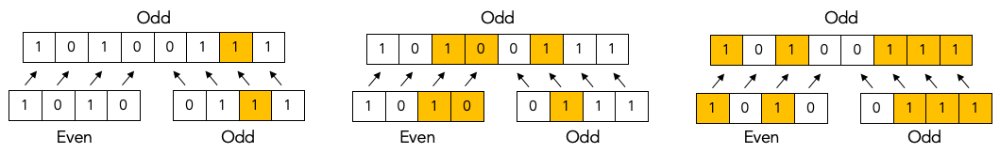

It is simply not possible that both sub-blocks have an even number of errors and it is also not possible that both sub-blocks have an odd number of errors.

Determine error parity of sub-blocks.
-------------------------------------

Bob doesn't know which it is: Bob doesn't know whether the left sub-block or the right sub-block has an odd number of errors. All Bob knows at this point is that the parent block has an odd number of errors.

In order to find out, Bon sends an *ask parity* message to Alice to ask the correct parity for the left sub-block (only the left sub-block, not the right sub-block). When Alice responds with the correct parity for the left sub-block, Bob can compute the error parity (odd or even) for the left sub-block: he just needs to combine the locally computed current parity with the correct parity provided by Alice.

If the error parity of the left sub-block turns out to be odd, then Bob immediately knows that the error parity of the right sub-block must be even.

On the other hand, if the error parity of the left sub-block turns out to be even, then Bob immediately knows that the error parity of the right sub-block must be odd.

Either way, Bob knows the error parity of both the left sub-block and the right sub-block. Bob only asked Alice to give the correct parity for the left sub-block. Bob never asked Alice to provide the correct parity for the right sub-block. Bob can infer the correct parity and hence error parity for the right sub-block (and so can Eve, by the way).

By the way, this inference trick only works if Bob knows for a fact that the error parity of the parent block is odd. That is why Bob is not allowed to run the Binary protocol on a block with even error parity.

Recursion.
----------

Once Bob has determined whether the left sub-block or the right sub-block contains an odd number of errors, Bob can recursively apply the Binary algorithm to that sub-block.

The Binary algorithm will keep recursing into smaller and smaller sub-blocks, until it finally reaches a sub-block that has a size of only a single bit.

If we have a sub-block whose size is one single bit and we also know that that same sub-block has an odd number of errors, then we can conclude that the single bit must be in error. We have found our single error bit that we can correct!

Let's look at a detailed example to get a better feel for how this works in practice:

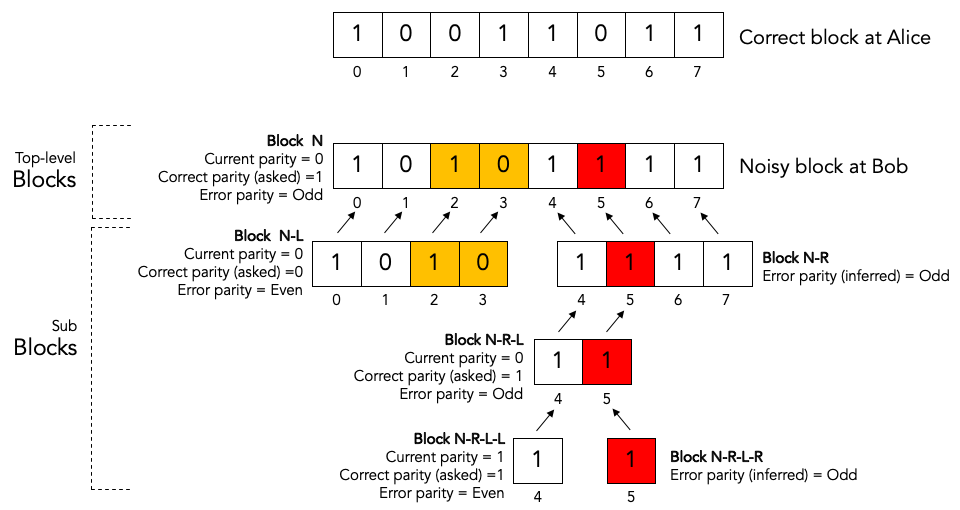

Bob has received a noisy key from Alice, he has shuffled that key, and he has split the shuffled key into top-level blocks. The block labeled "noisy block at Bob" is one of those blocks. Let's just call it block N.

For the sake of clarity we have show corresponding block in the correct key at Alice as well. This is the block labeled "correct block at Alice".

As we can see, there are three bit errors in the noisy top-level block, namely the colored blocks at block indexes 2, 3 and 5.

We will now show how the Binary algorithm will detect and correct exactly one of those errors, namely the red one at block index 5.

The other two errors, the orange onces at block index 2 and 3, will neither be detected nor corrected by the Binary algorithm.

Here are the steps:

1. Bob splits top-level block N into two sub-blocks: the left sub-block N-L, and the right sub-block N-R.

2. Bob determines the error parity for the blocks N-L and N-R as follows:

   2a. Bob computes the current parity over block N-L and finds that it is 0.

   2b. Bob asks Alice for the correct parity over block N-L and gets the answer that it is 0.

   2c. Since the current parity and the correct parity for block N-L are the same, Bob concludes that the error parity must be even.

   2d. Bob infers that block N-R must have odd error parity.

3. Bob recurses in the to sub-block with odd error parity, which is block N-R.

4. Bob splits sub-block N-R into two sub-sub-blocks: the left sub-sub-block N-R-L, and the right sub-sub-block N-R-R.

5. Bob determines the error parity for the blocks N-R-L and N-R-R as follows:

   5a. Bob computes the current parity over block N-R-L and finds that it is 0.

   5b. Bob asks Alice for the correct parity over block N-R-L and gets the answer that it is 1.

   5c. Since the current parity and the correct parity for block N-R-L are the different, Bob concludes that the error parity must be odd.

   5d. Bob doesn't care about block N-R-R because he has already found his block to recurse into.

6. Bob recurses in the to sub-sub-block with odd error parity, which is block N-R-L.

7. Bob splits sub-sub-block N-R-L into two sub-sub-sub-blocks: the left sub-sub-sub-block N-R-L-L, and the right sub-sub-sub-block N-R-L-R.

8. Bob determines the error parity for the blocks N-R-L-L and N-R-L-R as follows:

   8a. Bob computes the current parity over block N-R-L-L and finds that it is 1.

   8b. Bob asks Alice for the correct parity over block N-R-L-L and gets the answer that it is 1.

   8c. Since the current parity and the correct parity for block N-R-L-L are the same, Bob concludes that the error parity must be even.

   8d. Bob infers that block N-R-L-R must have odd error parity.

9. Bob notices that block N-R-L-R has a size of only one bit. Bob has found an error and corrects that error by flipping the bit!

What about the remaining errors after correcting a single bit error?
====================================================================

Now consider what happens after Bob corrected a single bit error in a block. Before the correction the block had an odd number of errors, which means that after the correction the block will contain an even number of errors. It may contain 0 remaining errors, but it may also contain 2 or 4 or 6 etc. remaining errors. As we saw in step 9, Bob cannot know which it is and Bob cannot do anything more to correct the remaining errors (if any). At least not during this iteration. There are two mechanisms that will likely correct these remaining even errors. The first mechanism is shuffling and the second mechanism is the cascading effect. We will describe each of these in turn.

The role of shuffling in error correction.
==========================================

Once a block reaches a point that it has an even number of errors, there is nothing more we can do to correct the remaining errors in that block. At least not in the current iteration. But in later iterations the remaining bit errors will end up in different blocks. This is because (a) the key will be shuffled into a different order in the alter iteration and (b) the later iteration will use a different block size. Thus even when a remaining bit error ends up in an even block during some iteration, it is quite likely that it will end up in an odd block during some later iteration.

The Cascade effect.
===================

The so-called Cascade effect is actually the most important mechanism for correcting any remaining bit errors that end up in an even block. The Cascade effect is tricky to understand. Later we will have some diagrams that will hopefully clarify things more, but let me give a brief introduction here.

This first thing to realize is that at the end of an iteration, all top-level blocks in the iteration will have an even number of errors. Either the block already had an even number of errors at the beginning of the iteration. Or the block started out with an odd number of errors, and exactly one error was corrected in the iteration so that we ended with an even number of errors.

Consider the situation that we correct a single bit error in iteration N. As we already pointed out, that block (which is part of iteration N) will end up with an even number of errors after the correct. Also, that correction will flip exactly one bit in the noisy key.

Now look at iteration N-1. We already know that all the blocks in iteration N-1 had an even parity at the end of iteration N-1.

When we flipped a single bit in the noisy key during iteration N, that single key bit was part of exactly one block in iteration N-1. Note that we are talking about two different blocks here. There is the block in iteration N where we did a single bit correct. That iteration N block ends up with an even number of errors. But then there is a different block in iteration N-1. That block was also affected by the key bit-flip in iteration N. The current parity the block in iteration N-1 flips. And hence the number of errors of the block in iteration N-1 becomes odd (it was even at the end of iteration N-1).

Everything I said about iteration N-1 is also true for iteration N-2, N-3, etc. In other words, it is true for all earlier iterations. Thus, correcting a single bit in iteration N causes one block with an odd number of errors in each of the earlier iterations.

Now that those blocks from earlier iterations have an odd number of errors, we can go back to them and correct a single bit error using the Binary protocol.

But wait! It gets better. When we go back and correct an error in an iteration N-1 block, that again creates additional blocks with odd numbers of errors in blocks N-2, N-3, etc.

This we can see that there is a sort of avalanche effect. Each bit correction creates opportunities for more bit corrections, which create even more opportunities for bit corrections, etc. This is the Cascade effect that the Cascade protocol is named after.

Parallelization.
================

In the BINARY protocol, whenever Bob wants to know whether a block contains an even or an odd number of errors, Bob must know the correct parity of the block.

The only way to know the correct parity of the block is to ask Alice:

* Bob must send a message to Alice to ask for the correct parity, and that message must specify for which block the parity is being asked.

* Alice must send a message back to Bob that contains the correct parity.

Each time Bob asks Alice for the correct parity of some block, there is a delay of at least one round trip time (RTT). For example if Alice and Bob are 100 km apart, the delay is at least 1 millisecond considering that the speed of light in fiber is 200,000 km/sec.

Variations on the Cascade Protocol.
===================================

The Cascade protocol is actually not a single protocol; it is a whole family of protocols. The literature describes many (around 10) different variations.

What have described thus far is the "original" Cascade protocol.

