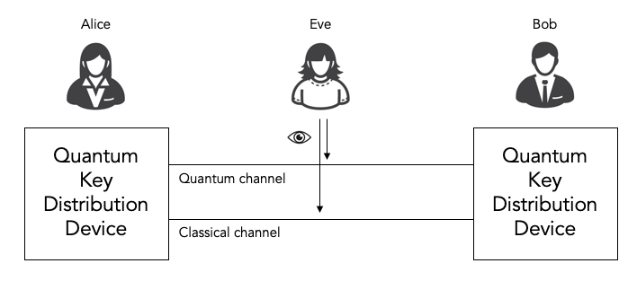
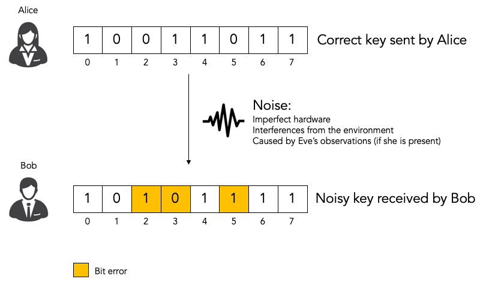
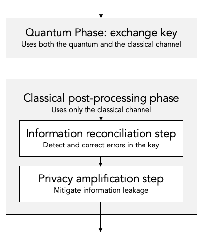
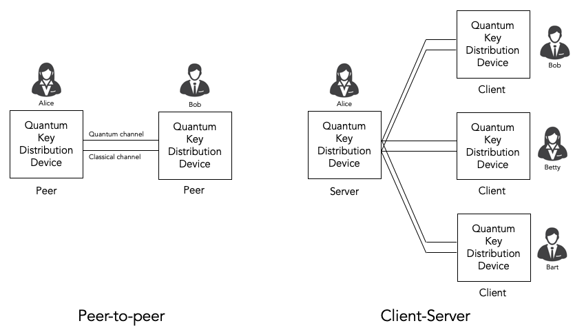
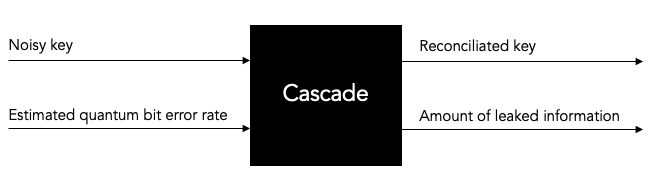

************************************************
The Cascade information reconciliation protocol.
************************************************

Quantum key distribution (QKD) protocols.
=========================================

All quantum key distribution (QKD) protocols involve using a combination of quantum communications (qubits) and classical communications (classical bits) to allow two parties Alice and Bob to agree on a secret key in such a way that our nefarious eavesdropper Eve cannot observe what the secret key is without being detected by Alice and Bob.

There are multiple quantum key distribution protocols, including for example BB84 and B92. All of these protocols consist of both a quantum phase and a classical post-processing phase.

The quantum phase uses both the quantum channel and the classical channel to actually exchange the key.

The classical post-processing phase only uses the classical channel. The classical post-processing phases is further sub-divided into two parts:

* Information reconciliation, which is responsible for detecting and correcting inevitable bit errors (noise) in the key that was exchanged during the quantum phase.

* Privacy enhancement, which is responsible for mitigating the information leakage during the information reconciliation step.

In this document we only discuss one specific information reconciliation protocol, namely the Cascade protocol.

We won't discuss privacy enhancement nor the quantum phase. Those interested in more details on the quantum phase can have a look at our `simulaqron-bb84-python <https://github.com/brunorijsman/simulaqron-bb84-python>`_ GitHub repository that contains a Python implementation of the quantum phase in the BB84 quantum key distribution protocol.

Key bit errors (noise).
=======================

Key distribution protocols always introduce some noise in the key. The key that Bob receives contains some noise (i.e. bit errors) as compared to the key that Alice sent. For that reason we refer to the key that Alice sent as the correct key and to the key that Bob received as the noisy key.

The noise can be introduced by imperfections in the hardware and by random fluctuations in the environment. Or the noise can be introduced by eavesdropper Eve observing traffic. Remember: in quantum mechanics observing a photon causes the photon to change and hence introduces detectable noise.

All quantum key distribution protocols provide an estimate of the noise level in the form of an estimated bit error rate. Bit error rate 0.0 means that no key bits have been flipped and bit error rate 1.0 means that all key bits have been flipped.

Classical post-processing.
==========================

If the estimated bit error rate is above some threshold we conclude that Eve is observing the traffic trying to determine the secret key. In that case, we abandon the key distribution attempt.

If the estimated bit error rate is below the threshold we perform classical post-processing, which consist of two steps. Both of these steps are classical protocols in the sense that they only involve classical communications and not any quantum communications

Information reconciliation.
---------------------------

The first classical post-processing step is information reconciliation. Even if the bit error rate is below the threshold, it is not zero. There is still some noise: there are still bit errors in the noisy key that Bob received as compared to the correct key that Alice sent. The purpose of the information reconciliation step is to detect and correct these remaining bit errors.

There are multiple information reconciliation protocols. In this document we discuss only one specific protocol, namely the Cascade protocol.

The tricky part to information reconciliation is to avoid leaking (i.e. exposing) too much information about the key. Eve, the eavesdropper, can learn any information that we leak during the information reconciliation step. Even if she does not learn the entire key, learning any leaked partial information about the key simplifies her task of decrypting the encrypted traffic. Every bit of leaked key information halves the number of keys that Eve has to try during a brute force attack.

That said, it is unavoidable that the information reconciliation protocol leaks some limited amount of information. This is okay as long as the amount of leaked information is bounded and known, so that we can compensate for it.

Privacy amplification.
----------------------

The second classical post-processing step is privacy amplification. The purpose of privacy amplification is to compensate for the information leakage in the information reconciliation step. Privacy amplification introduces extra randomness at the cost of reducing the effective key size.

In this document we do not discuss privacy amplification any further.

The Cascade protocol.
=====================

The Cascade protocol is one example of an information reconciliation protocol. The purpose of the Cascade protocol is to detect and to correct any remaining bit errors in the noisy key that Bob received relative to the correct key that Alice sent.

Let's say that Alice and Bob are the two parties that have just run the quantum phase of a quantum key distribution such as BB84. Alice has the correct key and Bob has a noisy key, which is similar to Alice's correct key but which has some limited number of bit errors (i.e. noise). Alice and Bob will now run the Cascade protocol to detect and correct any remaining bit errors in the Bob's noisy key.

Cascade as a client-server protocol.
====================================

From a protocol point of view, it makes sense to describe the Cascade protocol in terms of a client-server protocol.

Bob takes the role of the client. As far as Cascade is concerned, he is the active party. He decides what needs to happen when. He does most of the computation. And he sends messages to Alice when he needs her to do something.

Alice takes the role of the server. As far as Cascade is concerned, her role is mostly passive. She waits for Bob to ask her simple questions and she provides the answers.

We will describe the Cascade protocol from the perspective of the client, i.e. from the perspective of Bob.

An interesting observation is that the Cascade protocol puts most of the complexity and most of the computational burden on the client. The server doesn't do much except compute simple parities when asked to do so by the client. This is a very nice property for a client-server protocol. The server could have many (thousands) of sessions to clients, so it is very desirable that each session is simple and light-weight. The client will typically have only a few sessions to a few servers, so it is okay if the sessions are more complex and heavy-weight.

It is fair to say that quantum key distribution is currently often (almost always, perhaps) used to secure point-to-point links with a quantum key distribution device on either end of the link. From that perspective it is natural to think of Cascade as a peer-to-peer protocol.

That said, quantum key distribution in general and Cascade in particular could very well be deployed in true client-server scenarios. One example scenario is secure web traffic where a web server (e.g. Apache) has many session to many different web clients (e.g. Chrome web browsers) using the HTTPS protocol.

The classical channel.
======================

Cascade is a fully classical protocol. It only involves the exchange of classical messages. It does not involve any quantum communications.

We assume that there is a classical channel between Alice and Bob that allows Alice and Bob to exchange classical messages as part of the Cascade protocol. We rely on classical techniques to provide reliability, flow-control, etc. (for example, we could use TCP/IP).

We do not require that the classical channel is encrypted: we assume that eavesdropper Eve can observe all classical messages in the clear.

Any requirement that the classical channel be encrypted would introduce a chicken-and-egg problem: we would need a quantum key distribution protocol to encrypt the classical channel, but the quantum key distribution protocol would need an encrypted classical channel.

We do, however, require that the classical channel provides authentication and integrity. We assume that there is a mechanism that allows Alice and Bob to verify that all classical messages were actually sent by Bob and Alice and have not been forged or tampered with by Eve.

This is needed to avoid woman-in-the-middle attacks by Eve, where Eve intercepts all classical traffic and pretends to be Bob to Alice and pretends to Alice to Bob.

We do not discuss how the authentication and integrity are implemented nor does the code in this repository contain any authentication or integrity mechanisms.

This is consistent with most of the literature on quantum key distribution. Most literature barely mentions the need for an authentication and integrity on the classical channel. Details on how to do it are even less forthcoming. This might give you the impression that it is a trivial matter not worth discussing. Nothing could be further from the truth!

Yes, it is true that authentication and integrity are considered to be well-solved problems for classical protocols. For authentication, classical protocols typically use either public key infrastructure (PKI) or pre-shared keys. For integrity, classical protocols typically use hash-based message authentication codes (HMAC) in combination with Diffie-Hellman or pre-shared keys to agree on the message authentication key.

But none of those options (pre-shared keys, public key infrastructure, Diffie-Hellman) are attractive options for quantum key distribution.

Public-key infrastructure and Diffie-Hellman are problematic because they are not quantum-safe: they rely on the assumption that factorization or modular logarithms are computationally difficult.

Pre-shared keys are somewhat acceptable for point-to-point connections, but they are really problematic in client-server scenarios where the client does not know a-priori which clients will connect to it. But more importantly, using pre-shared keys defeats the whole purpose of running a quantum key distribution protocol.

In summary: while the topic of authenticating the classical channel is usually glossed over, it is not at all obvious how to achieve it in the context of quantum key distribution.

Input and output of the Cascade protocol.
=========================================

Let's start by looking at the Cascade protocol as a black box algorithm, and let's consider what the input and the output of the Cascade protocol are.

Input: noisy key and estimated quantum bit error rate (QBER).
-------------------------------------------------------------

Bob initiates the Cascade protocol after the quantum phase of the quantum key distribution has been completed.

At this point, Bob has the following information available to him,  which is the input to the Cascade protocol.

Bob has the noisy key that he has received from Alice. Although a quantum key distribution protocol was used to agree on this key, there is nothing quantum about the key at this point. It is just a string of classical bits of a certain length (the key size).

As we described earlier, the quantum key distribution protocol introduces some noise when it delivers this key to Bob. Thus, Bob has a noisy key which has some bit errors compared to Alice's correct key.

Bob does not know exactly how many bit errors there are or which bits are in error, but the quantum key distribution protocol does provide an estimate of the bit error rate, which also known as the quantum bit error rate (QBER).

Thus, we have two inputs to the Cascade protocol: the noisy key and the estimated quantum bit error rate (QBER).

Output: reconciliated key and amount of leaked information.
-----------------------------------------------------------

Is the job of the Cascade protocol to determine which bits exactly are in error and to fix them.

It is important to understand that Cascade does not guarantee that all bit errors are corrected. In other words, Bob's reconciliated key is still not guaranteed to be the same as Alice's correct key. Even after the reconciliation is complete, there is still a remaining bit error rate. The remaining bit error rate is orders of magnitude smaller than the original bit error rate before Cascade was run. But it is not zero. That is why we prefer to use the term reconciliated key and not corrected key, although the latter is also often used.

Cascade per-se does not contain any mechanism to detect and report whether the reconciliation was successful. It will neither detect nor report that there are any remaining bit errors after reconciliation. Some mechanism outside of Cascade is needed to validate whether the reconciliated key is correct or not.

The Cascade protocol can also keep track of exactly how much information was leaked. Specifically, Cascade running at Bob can keep track of which parities he asked Alice to compute. We must assume that Eve will also know about those parities. We can express the amount of leaked information in terms of leaked key bits (this is a logical abstraction - it does not indicate which specific key bits were leaked, it only provides a measure of how much information was leaked).

The amount of leaked information may be used by the privacy amplification phase that runs after the information reconciliation phase to determine how much amplification is needed.

Thus, the output of Cascade are the reconciliated key and the amount of leaked information.

Variations of the Cascade protocol.
===================================

The Cascade protocol is actually not a single protocol; it is a whole family of protocols. The literature describes many (around 10) different variations.

We start by describing the so-called original Cascade protocol that was described in @@@. We will describe the other variations at the end of this chapter.

Cascade Iterations.
===================

Let's define a single run of the Cascade protocol as Alice and Bob reconciliating (i.e. attempting to correct) a single key.

A single Cascade run consists of multiple iterations.

The original Cascade protocol uses 4 iterations, but other variations use different numbers of iterations.

Key shuffling.
==============

During each iteration, except the first one, Bob randomly shuffles the bits in the noisy key:

[FIGURE]

As a result, @@@

Bob informs Alice how the bits were shuffled without exposing any information about the key bit values themselves, for example as follows:

[FIGURE]

Creation of the top-level blocks.
=================================

After

Bob divides the shuffled key into blocks. The number of blocks depends on the iteration. Early iterations have more blocks than late iterations. These blocks are called top-level blocks (as opposed to sub-blocks that we will see later).

For each top-level block Bob does the following.

Computing the error parity for each top-level block: even or odd.
=================================================================

During each iteration, after having split the shuffled key for that iteration into blocks, Bob performs the following step to determine whether each block has an even or an odd number of remaining bit errors (this is called the error parity).

Computing the current parity.
-----------------------------

Bob locally computes the actual parity of each top-level block. This is a parity over some subset of bits in the shuffled noisy key that Bob has received from Alice.

Asking Alice for the correct parity.
------------------------------------

Bob asks Alice to compute the correct parity over the same top-level blocks. Thus, Bob sends a message to Alice to ask her "please compute the correct parity" over such-and-such blocks. This message only contains enough information to identify over what blocks the parity needs to be computed. It does not expose any information about the value of the key bits in that block.

Alice sends a response back to Bob containing the computed correct parity. Alice has computed this correct parity over the correct key (which only Alice has). The parity that Bob computed earlier what the actual parity that was computed over the noisy key (which only Bob has).

Divulging the correct parity constitutes information leakage.
-------------------------------------------------------------

Although neither Alice nor Bob ever divulge any actual key bits, the divulgence of the parity leaks a little bit of information to Eve. This is easy to understand if we look at the number of values Eve has to try out in a brute force attack. If Eve knows nothing about N bits, she has to try out 2N values in a brute force attack. But if she knows the parity of those N bits, she only has to try out 2N-1 values.

Inference the error parity from current parity and the correct parity.
----------------------------------------------------------------------

At this point Bob knows both the correct parity and the actual parity of the block. Based on those two pieces of information, Bob can determine whether there is an even number of errors or an odd number of errors in the block.

Correcting a single it in top-level blocks with odd error parity.
=================================================================

Treatment of blocks with even error parity.
-------------------------------------------

If the number of errors is even, Bob cannot know whether there are any bit errors in the block or whether there are no bit errors in the block. This is because zero errors is considered to be an even number of errors. For such a block, there is nothing more Bob can do.

Treatment of blocks with odd error parity.
------------------------------------------

If the number of errors is odd, Bob knows that there is at least one remaining bit error in the block. Bob doesn't know whether there is 1 or 3 or 5 or whatever remaining bit errors, but he does now there is at least one and that the number is odd. For such a block, Bob will correct exactly one remaining bit error. Bob uses the Binary protocol to correct a single bit error in a block; we describe the Binary protocol separately below. The Binary protocol itself is rather complex and we would interrupt the flow of reasoning if we described it here. For now, just think of the Binary protocol that guarantees that it corrects exactly one bit error if we start with a block that contains an odd number of bit errors.

What about the remaining errors after correcting a single bit error?
--------------------------------------------------------------------

Now consider what happens after Bob corrected a single bit error in a block. Before the correction the block had an odd number of errors, which means that after the correction the block will contain an even number of errors. It may contain 0 remaining errors, but it may also contain 2 or 4 or 6 etc. remaining errors. As we saw in step 9, Bob cannot know which it is and Bob cannot do anything more to correct the remaining errors (if any). At least not during this iteration. There are two mechanisms that will likely correct these remaining even errors. The first mechanism is shuffling and the second mechanism is the cascading effect. We will describe each of these in turn.

The role of shuffling in error correction.
==========================================

Once a block reaches a point that it has an even number of errors, there is nothing more we can do to correct the remaining errors in that block. At least not in the current iteration. But in later iterations the remaining bit errors will end up in different blocks. This is because (a) the key will be shuffled into a different order in the alter iteration and (b) the later iteration will use a different block size. Thus even when a remaining bit error ends up in an even block during some iteration, it is quite likely that it will end up in an odd block during some later iteration.

The Cascade effect.
===================

The so-called Cascade effect is actually the most important mechanism for correcting any remaining bit errors that end up in an even block. The Cascade effect is tricky to understand. Later we will have some diagrams that will hopefully clarify things more, but let me give a brief introduction here.

This first thing to realize is that at the end of an iteration, all top-level blocks in the iteration will have an even number of errors. Either the block already had an even number of errors at the beginning of the iteration. Or the block started out with an odd number of errors, and exactly one error was corrected in the iteration so that we ended with an even number of errors.

Consider the situation that we correct a single bit error in iteration N. As we already pointed out, that block (which is part of iteration N) will end up with an even number of errors after the correct. Also, that correction will flip exactly one bit in the noisy key.

Now look at iteration N-1. We already know that all the blocks in iteration N-1 had an even parity at the end of iteration N-1.

When we flipped a single bit in the noisy key during iteration N, that single key bit was part of exactly one block in iteration N-1. Note that we are talking about two different blocks here. There is the block in iteration N where we did a single bit correct. That iteration N block ends up with an even number of errors. But then there is a different block in iteration N-1. That block was also affected by the key bit-flip in iteration N. The current parity the block in iteration N-1 flips. And hence the number of errors of the block in iteration N-1 becomes odd (it was even at the end of iteration N-1).

Everything I said about iteration N-1 is also true for iteration N-2, N-3, etc. In other words, it is true for all earlier iterations. Thus, correcting a single bit in iteration N causes one block with an odd number of errors in each of the earlier iterations.

Now that those blocks from earlier iterations have an odd number of errors, we can go back to them and correct a single bit error using the Binary protocol.

But wait! It gets better. When we go back and correct an error in an iteration N-1 block, that again creates additional blocks with odd numbers of errors in blocks N-2, N-3, etc.

This we can see that there is a sort of avalanche effect. Each bit correction creates opportunities for more bit corrections, which create even more opportunities for bit corrections, etc. This is the Cascade effect that the Cascade protocol is named after.

Parallelization.
================

In the BINARY protocol, whenever Bob wants to know whether a block contains an even or an odd number of errors, Bob must know the correct parity of the block.

The only way to know the correct parity of the block is to ask Alice:

* Bob must send a message to Alice to ask for the correct parity, and that message must specify for which block the parity is being asked.

* Alice must send a message back to Bob that contains the correct parity.

Each time Bob asks Alice for the correct parity of some block, there is a delay of at least one round trip time (RTT). For example if Alice and Bob are 100 km apart, the delay is at least 1 millisecond considering that the speed of light in fiber is 200,000 km/sec.

Variations on the Cascade Protocol.
===================================

.

