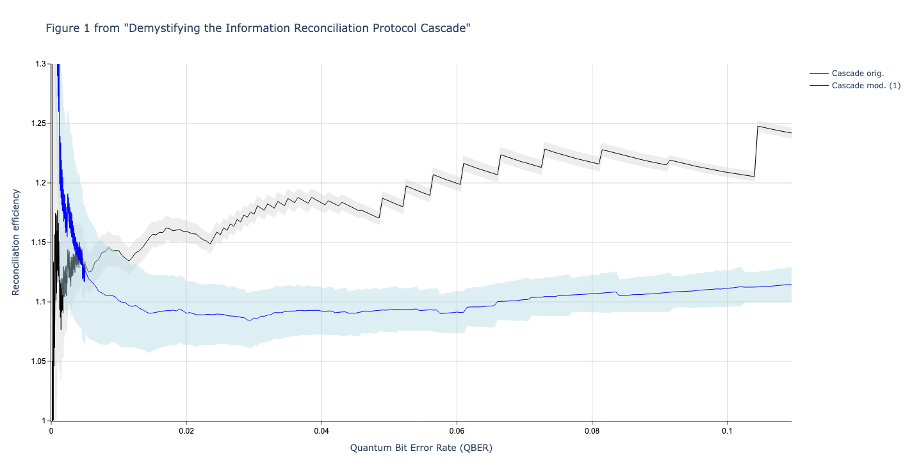
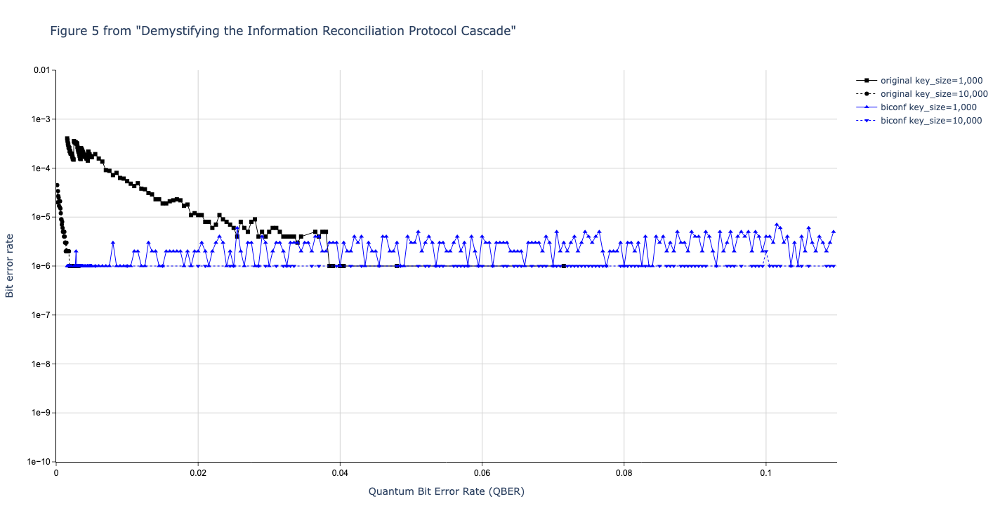
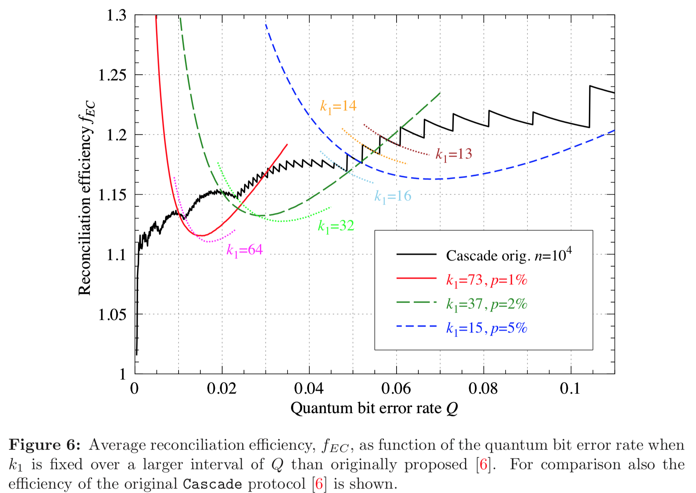
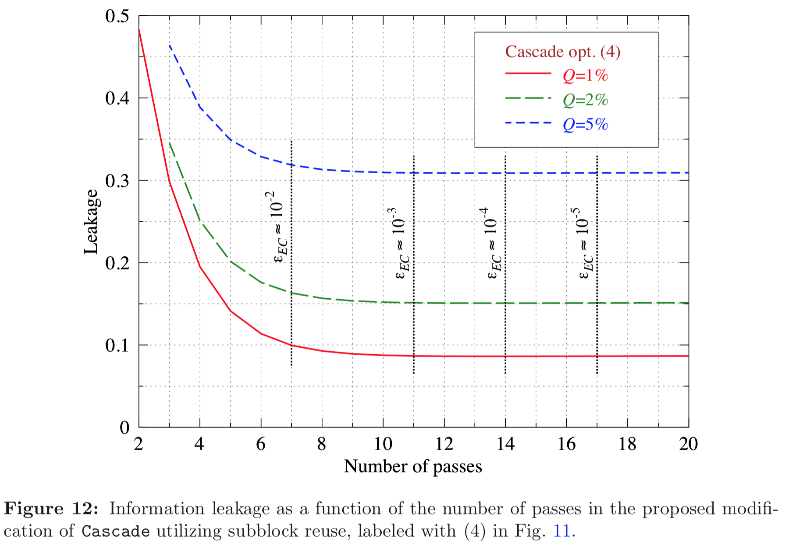
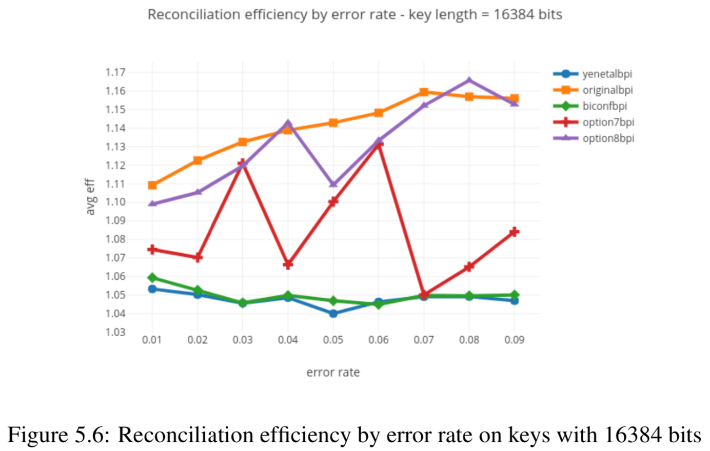

******************************************
Raw Comparison of Results with Literature.
******************************************

Comparison with "Demystifying the Information Reconciliation Protocol Cascade"
==============================================================================

Here we compare the results of our Python Cascade implementatin with the results reported in the following paper:

`Demystifying the Information Reconciliation Protocol Cascade. <https://arxiv.org/abs/1407.3257>`_ *Jesus Martinez-Mateo, Christoph Pacher, Momtchil Peev, Alex Ciurana, and Vicente Martin.* arXiv:1407.3257 [quant-ph], Jul 2014.

Figure 1
--------

Original figure in paper:

.. image:: figures/demystifying-figure-1-original.png
    :align: center

Reproduced figure from this code:

The original and the reproduced figure match very well.

The original graph has more detail because they executed more runs per data point (this is true for all graphs, so we won't repeat this point.)

The original graph does not have any indication of the standard deviation (this is true for all graphs, so we won't repeat this point).

In order to get my results to match well with the results reported in the literature, I had to use a very unrealistic definition of reconciliation efficiency. This is discussed in more detail in the comparison conclusions section.

Figure 2
--------

Original figure in paper:

.. image:: figures/demystifying-figure-2-original.png
    :align: center

Reproduced figure from this code:

.. image:: figures/demystifying-figure-2-reproduced.png
    :align: center

At first blush the original and the reproduced figure match are quite similar.

However, both the original algorithm (black line) and the modified algorithm (blue) line have a more distinct drop-off towards the right side of the figure.

For example, in the figure from the original paper, as the x-axis increases from bit error rate 0.03 to 1.10, the jigsaw shape of the blue line starts to have bigger "jigsaws" and also distinctly slopes down. In the reproduced graph, we do see the bigger "jigsaws" but we don't see the downward slope: the line stays essentially flat. I currently have no explanation for this difference.

Figure 3
--------

Original figure in paper:

.. image:: figures/demystifying-figure-3-original.png
    :align: center

Reproduced figure from this code:

.. image:: figures/demystifying-figure-3-reproduced.png
    :align: center

Figure 4
--------

Original figure in paper:

Reproduced figure from this code:

Figure 5
--------

Original figure in paper:

.. image:: figures/demystifying-figure-5-original.png
    :align: center

Reproduced figure from this code:

Figure 6
--------

Original figure in paper:

This figure is not (yet) reproduced by the code.

Figure 7
--------

Original figure in paper:

.. image:: figures/demystifying-figure-7-original.png
    :align: center

This figure is not (yet) reproduced by the code.

Figure 8
--------

Original figure in paper:

Reproduced figure from this code:

Figure 9
--------

Original figure in paper:

.. image:: figures/demystifying-figure-9-original.png
    :align: center

Reproduced figure from this code:

.. image:: figures/demystifying-figure-9-reproduced.png
    :align: center

Figure 10
---------

Original figure in paper:

Reproduced figure from this code:

.. image:: figures/demystifying-figure-10-reproduced.png
    :align: center

Figure 11
---------

Original figure in paper:

.. image:: figures/demystifying-figure-11-original.png
    :align: center

Reproduced figure from this code:

.. image:: figures/demystifying-figure-11-reproduced.png
    :align: center

Figure 12
---------

Original figure in paper:

This figure is not (yet) reproduced by the code.

Figure 13
---------

Original figure in paper:

.. image:: figures/demystifying-figure-13-original.png
    :align: center

Reproduced figure from this code:

.. image:: figures/demystifying-figure-13-reproduced.png
    :align: center

Comparison with "André Reis Thesis"
===================================

Figure 5.1
----------

Original figure in thesis:

.. image:: figures/andre-reis-thesis-figure-5-1-original.png
    :align: center

Reproduced figure from this code:

.. image:: figures/andre-reis-thesis-figure-5-1-reproduced.png
    :align: center

Figure 5.2
----------

Original figure in thesis:

.. image:: figures/andre-reis-thesis-figure-5-2-original.png
    :align: center

Reproduced figure from this code:

.. image:: figures/andre-reis-thesis-figure-5-2-reproduced.png
    :align: center

Figure 5.3
----------

Original figure in thesis:

.. image:: figures/andre-reis-thesis-figure-5-3-original.png
    :align: center

Reproduced figure from this code:

Figure 5.4
----------

Original figure in thesis:

.. image:: figures/andre-reis-thesis-figure-5-4-original.png
    :align: center

This figure is not (yet) reproduced by the code.

Figure 5.5
----------

Original figure in thesis:

.. image:: figures/andre-reis-thesis-figure-5-5-original.png
    :align: center

Reproduced figure from this code:

Figure 5.5b is not (yet) reproduced by the code.

Figure 5.6
----------

Original figure in thesis:

This figure is not (yet) reproduced by the code.

Figure 5.7
----------

Original figure in thesis:

.. image:: figures/andre-reis-thesis-figure-5-7-original.png
    :align: center

This figure is not (yet) reproduced by the code.

Figure 5.8
----------

Original figure in thesis:

.. image:: figures/andre-reis-thesis-figure-5-8-original.png
    :align: center

This figure is not (yet) reproduced by the code.

Figure 5.9
----------

Original figure in thesis:

.. image:: figures/andre-reis-thesis-figure-5-9-original.png
    :align: center

This figure is not (yet) reproduced by the code.

Figure 5.10
-----------

Original figure in thesis:

.. image:: figures/andre-reis-thesis-figure-5-10-original.png
    :align: center

This figure is not (yet) reproduced by the code.
