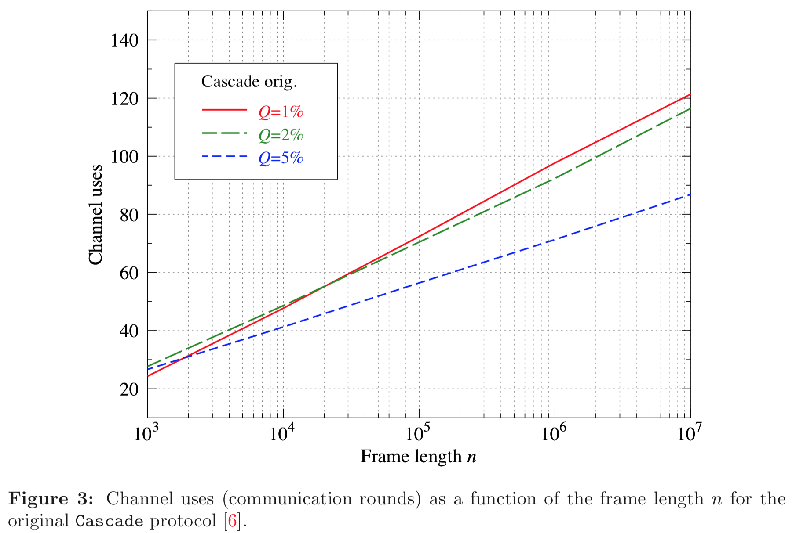

******************************************
Raw Comparison of Results with Literature.
******************************************

Comparison with "Demystifying the Information Reconciliation Protocol Cascade"
==============================================================================

Here we compare the results of our Python Cascade implementation with the results reported in the following paper:

`Demystifying the Information Reconciliation Protocol Cascade. <https://arxiv.org/abs/1407.3257>`_ *Jesus Martinez-Mateo, Christoph Pacher, Momtchil Peev, Alex Ciurana, and Vicente Martin.* arXiv:1407.3257 [quant-ph], Jul 2014.

Figure 1
--------

Original figure in paper:

.. image:: figures/demystifying-figure-1-original.png
    :align: center

Reproduced figure from this code:

.. image:: figures/demystifying-figure-1-reproduced.png
    :align: center

The original and the reproduced figure match very well.

The original graph has more detail because they executed more runs per data point (this is true for all graphs, so we won't repeat this point.)

The original graph does not have any indication of the standard deviation (this is true for all graphs, so we won't repeat this point).

Figure 2
--------

Original figure in paper:

.. image:: figures/demystifying-figure-2-original.png
    :align: center

Reproduced figure from this code:

.. image:: figures/demystifying-figure-2-reproduced.png
    :align: center

At first blush the original and the reproduced figure match are quite similar.

However, both the original algorithm (black line) and the modified algorithm (blue) line have a more distinct drop-off towards the right side of the figure.

For example, in the figure from the original paper, as the x-axis increases from bit error rate 0.03 to 1.10, the jigsaw shape of the blue line starts to have bigger "jigsaws" and also distinctly slopes down. In the reproduced graph, we do see the bigger "jigsaws" but we don't see the downward slope: the line stays essentially flat. I currently have no explanation for this difference.

Figure 3
--------

Original figure in paper:

Reproduced figure from this code:

.. image:: figures/demystifying-figure-3-reproduced.png
    :align: center

In the original figure, the frame length (the x-axis) ranges from 10^3 to 10^7. In the reproduced figure the frame length only ranges from 10^3 to 10^5. This is because my Python code was too slow to run many iterations for key lengths 10^6 or 10^7.

In the original figure, the lines are perfectly straight. In the reproduced figure the lines are very slightly curved.

Other than those minor differences, the original and reproduced figure match very well: they shapes are very similar and the lines cross over at the same points.

Figure 4
--------

Original figure in paper:

.. image:: figures/demystifying-figure-4-original.png
    :align: center

Reproduced figure from this code:

.. image:: figures/demystifying-figure-4-reproduced.png
    :align: center

The reproduced figure is mostly useless: for small frame error rates (below 10^-3) the reproduced figure falls apart. This is because I only did 1,000 iterations per data point. The Python code was too slow to do more iterations per data point. To detect frame errors below 10^-n we need to do at least 10^n iterations. Hence, running only 1,000 iterations it is only to be expected that we cannot detect frame error rates below 10^-3.

Hopefully, when we have a faster C++ implementation we will be able to study lower error rates.

Figure 5
--------

Original figure in paper:

.. image:: figures/demystifying-figure-5-original.png
    :align: center

Reproduced figure from this code:

.. image:: figures/demystifying-figure-5-reproduced.png
    :align: center

Once again, the reproduced figure is mostly useless, for similar reasons to figure 4.

Due to the slow Python code, we only did 1,000 (10^3) iterations per data point. For key size 1,000 (10^3) this means we cannot bit error rates below 10^-6. And for key siz 10,000 (10^4) this means we cannot detect bit error rate below 10^-7.

As expected, the reproduced figure 5 falls apart below these 10^-6 (black line) and 10^-7 (blue line) bit error rates.

Again, hopefully, when we have a faster C++ implementation we will be able to run more iterations per data point and hence study lower error rates.

Figure 6
--------

Original figure in paper:

.. image:: figures/demystifying-figure-6-original.png
    :align: center

This figure is not (yet) reproduced by the code.

Figure 7
--------

Original figure in paper:

.. image:: figures/demystifying-figure-7-original.png
    :align: center

This figure is not (yet) reproduced by the code.

Figure 8
--------

Original figure in paper:

.. image:: figures/demystifying-figure-8-original.png
    :align: center

Reproduced figure from this code:

.. image:: figures/demystifying-figure-8-reproduced.png
    :align: center

The original and the reproduced figure match very well.

Once again, the original graph has more detail because they executed more runs per data point.

Figure 9
--------

Original figure in paper:

Reproduced figure from this code:

.. image:: figures/demystifying-figure-9-reproduced.png
    :align: center

There are few noticeable differences between the original figure and the reproduced figure.

There is of course the fact that the original figure has more detail than the reproduced figure, because we run fewer iterations per data point.

The black, green, and blue graphs match reasonably well in the original and the int reproduced figure. They have very similar values and similar shapes including the obvious saw-teeth. There are a few differences in the details though.

We already observed the first difference in figure 2. In the original graph the blue graph clearly slopes down towards the end. In the reproduced graph the blue line saw-tooths around a flat trend instead of trend that slopes down.

In the green and the black graphs, we also see a difference. In the original graph we see a lower frequency secondary wave pattern on top of the higher frequency saw-teeth. For example, there are 6 "waves" in the green graph and lots of saw-teeth within each "wave". In the reproduced green and black graphs, we do not see these "waves".

The last and biggest difference is in the red graph. This graph is completely different in the original vs reproduced figure. In the original figure the red graph is much higher (above the blue graph) and has much bigger saw-teeth.

I currently do not have an explanation for any of these observed differences.

Figure 10
---------

Original figure in paper:

.. image:: figures/demystifying-figure-10-original.png
    :align: center

Reproduced figure from this code:

.. image:: figures/demystifying-figure-10-reproduced.png
    :align: center

Figure 11
---------

Original figure in paper:

Reproduced figure from this code:

.. image:: figures/demystifying-figure-11-reproduced.png
    :align: center

Figure 12
---------

Original figure in paper:

.. image:: figures/demystifying-figure-12-original.png
    :align: center

This figure is not (yet) reproduced by the code.

Figure 13
---------

Original figure in paper:

.. image:: figures/demystifying-figure-13-original.png
    :align: center

Reproduced figure from this code:

.. image:: figures/demystifying-figure-13-reproduced.png
    :align: center

Comparison with "André Reis Thesis"
===================================

Figure 5.1
----------

Original figure in thesis:

Reproduced figure from this code:

.. image:: figures/andre-reis-thesis-figure-5-1-reproduced.png
    :align: center

Figure 5.2
----------

Original figure in thesis:

Reproduced figure from this code:

.. image:: figures/andre-reis-thesis-figure-5-2-reproduced.png
    :align: center

Figure 5.3
----------

Original figure in thesis:

Reproduced figure from this code:

.. image:: figures/andre-reis-thesis-figure-5-3-reproduced.png
    :align: center

Figure 5.4
----------

Original figure in thesis:

This figure is not (yet) reproduced by the code.

Figure 5.5
----------

Original figure in thesis:

Reproduced figure from this code:

.. image:: figures/andre-reis-thesis-figure-5-5a-reproduced.png
    :align: center

Figure 5.5b is not (yet) reproduced by the code.

Figure 5.6
----------

Original figure in thesis:

.. image:: figures/andre-reis-thesis-figure-5-6-original.png
    :align: center

This figure is not (yet) reproduced by the code.

Figure 5.7
----------

Original figure in thesis:

This figure is not (yet) reproduced by the code.

Figure 5.8
----------

Original figure in thesis:

.. image:: figures/andre-reis-thesis-figure-5-8-original.png
    :align: center

This figure is not (yet) reproduced by the code.

Figure 5.9
----------

Original figure in thesis:

.. image:: figures/andre-reis-thesis-figure-5-9-original.png
    :align: center

This figure is not (yet) reproduced by the code.

Figure 5.10
-----------

Original figure in thesis:

This figure is not (yet) reproduced by the code.
