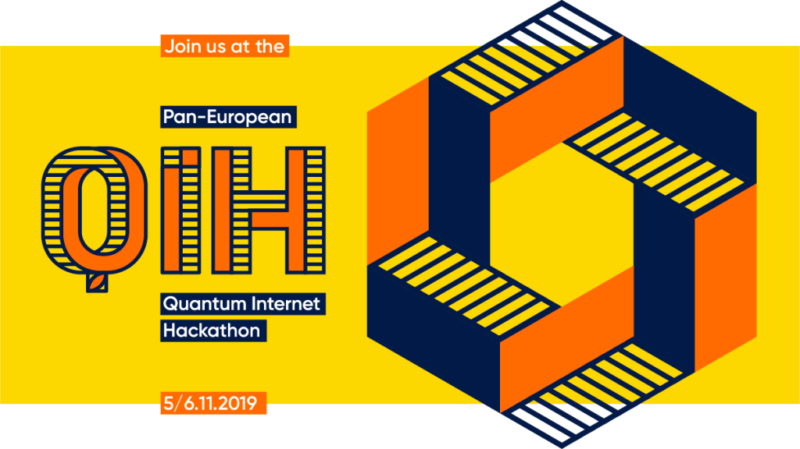
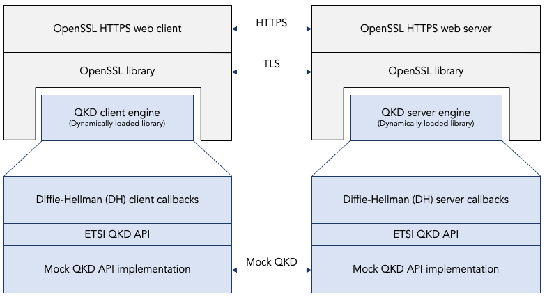

*************************
Context for this project.
*************************

The pan-European quantum Internet hackathon.
============================================

On 5 and 6 November 2019 I (`Bruno Rijsman <https://www.linkedin.com/in/brunorijsman/>`_) took part in the `Pan-European Quantum Internet Hackathon <https://labs.ripe.net/Members/ulka_athale_1/take-part-in-pan-european-quantum-internet-hackathon>`_ organized by `RIPE labs <https://labs.ripe.net/>`_.

Participants from six geographically distributed locations (Delft, Dublin, Geneva, Padua, Paris, and Sarajevo) formed teams that worked on various projects related to the `Quantum Internet <https://qutech.nl/wp-content/uploads/2018/10/Quantum-internet-A-vision.pdf>`_.

I participated in Delft where the hackathon was hosted by `QuTech <https://qutech.nl/>`_, a world-leading quantum technology research and development office within the `Delft University of Technology <https://www.tudelft.nl/>`_.

The OpenSSL integration challenge.
==================================

In Delft, I joined `Yvo Keuter <https://www.linkedin.com/in/yvo-keuter-6794932>`_ and `Tim Janssen <https://www.linkedin.com/in/timjanssen89/>`_ to form a team working on one of the `challenges suggested by the hackathon organizers <https://github.com/PEQI19/challenges>`_, namely the `OpenSSL integration challenge <https://github.com/PEQI19/PEQI-OpenSSL>`_.

This challenge was developed by `Wojciech Kozlowski <https://www.linkedin.com/in/wojciech-kozlowski/>`_, a postdoctoral researcher at `QuTech <https://qutech.nl/>`_ and one of the organizers of the Delft hackathon. He is also the main author of the `Architectural Principles of the Quantum Internet <https://datatracker.ietf.org/doc/draft-irtf-qirg-principles/>`_ document that is being developed in the `Quantum Internet Research Group (QIRG) <https://datatracker.ietf.org/rg/qirg/about/>`_ in the `Internet Research Task Force (IRTF) <https://irtf.org/>`_.

The OpenSSL integration challenge consists of two parts:

1. Enhance `OpenSSL <http://openssl.org/>`_ to be able to use `Quantum Key Distribution (QKD) <https://en.wikipedia.org/wiki/Quantum_key_distribution>`_ as a `key agreement protocol <https://en.wikipedia.org/wiki/Key-agreement_protocol>`_. OpenSSL is an open source cryptography library that implements the `Secure Sockets Layer (SSL) and Transport Layer Security (TLS) <https://en.wikipedia.org/wiki/Transport_Layer_Security>`_ protocols. OpenSSL is widely used in Internet applications such as web browsers and web servers.

2. Implement a specific quantum key distribution protocol, namely the `Bennett and Brassard 1984 (BB84) <https://en.wikipedia.org/wiki/BB84>`_ protocol, on top of the SimulaQron quantum network simulator.

The end-goal of the challenge is to use an off-the-shelf browser (e.g. Chrome) and connect it to a secure HTTPS website hosted on an off-the-shelf web server (e.g. Apache), while using the BB84 quantum key distribution algorithm as the key agreement protocol (running a `SimulaQron <http://www.simulaqron.org/>`_ simulated quantum network), instead of the classical Diffie-Hellman protocol that is normally used in classical networks.

Implementation of the "upper half."
===================================

The following figure shows what was actually achieved soon after the end of the hackathon.

This is called the "upper half" of the solution for the OpenSSL integration challenge.

For more details on this so-called "upper half" of the implementation see @@@, and for the documentation see @@@.
