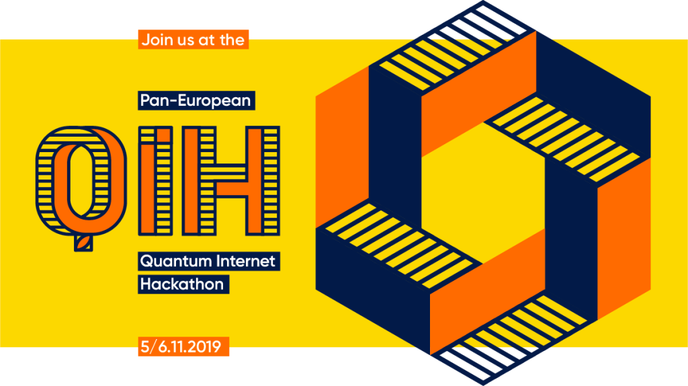
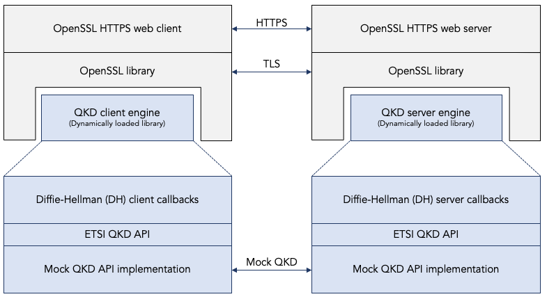

*************
Introduction.
*************

What is in this GitHub repository?
==================================

This GitHub repository contains a Python implementation of the Cascade information reconciliation protocol. Information reconciliation protocols in general, and the Cascade protocol in particular, are a small but important and complex step in quantum key distribution (QKD) protocols. They are intended to detect and correct inevitable bit errors in the distributed key.

This repository also contains Python scripts that analyze the Cascade protocol and reproduce the analysis results that were previously reported in the following academic papers:

* Jesus Martinez-Mateo, Christoph Pacher, Momtchil Peev, Alex Ciurana, and Vicente Martin. `Demystifying the Information Reconciliation Protocol Cascade. <https://arxiv.org/pdf/1407.3257.pdf>`_ arXiv:1407.3257 [quant-ph], Jul 2014.

* André Reis. `Quantum Key Distribution Post Processing - A Study on the Information Reconciliation Cascade Protocol. <https://repositorio-aberto.up.pt/bitstream/10216/121965/2/347567.pdf>`_ Master's Thesis, Faculdade de Engenharia, Universidade do Porto. Jul 2019.

Finally, this repository contains extensive documentation describing the Cascade protocol, our implementation of the Cascade protocol, the findings of reproducing the Cascade analysis results from the academic literature, and lessons learned.

The broader context.
====================

The code in this GitHub repository is just a small step in the larger project of adding full support for quantum key distribution (QKD) to OpenSSL. This larger project includes other GitHub repositories:

* The `openssl-qkd <https://github.com/brunorijsman/openssl-qkd>`_ GitHub repository contains a C implementation of a dynamically loaded engine for OpenSSL. This engine replace a classic Diffie-Hellman key exchange with a quantum key distribution (QKD) mechanism. The actual quantum key distribution protocol is not part of this repository. Instead, the engine invokes a stub implementation of `application programmer interface (API) <https://www.etsi.org/deliver/etsi_gs/QKD/001_099/004/01.01.01_60/gs_qkd004v010101p.pdf>`_ defined by European telecommunications standards institute (ETSI).

* The `simulaqron-bb84-python <https://github.com/brunorijsman/simulaqron-bb84-python>`_ GitHub repository contains a Python implementation of the BB84 quantum key distribution (QKD) protocol. It runs on top of the `SimulaQron <http://www.simulaqron.org/>`_ quantum network simulator.

All of these repositories are also just small steps working towards the overall goal adding full support for quantum key distribution to OpenSSL. Much work remains to be done, which is summarized at the end of this chapter.

Once the OpenSSL library supports quantum key distribution, then many applications that use OpenSSL (such as for example web servers and web clients) will be able to use quantum key distribution with little or no code changes to the application itself.

The initial goal is to support simulated quantum networks using simulators such as `SimulaQron <http://www.simulaqron.org/>`_ or `NetSquid <https://netsquid.org/>`_, both developed at `QuTech <https://netsquid.org/>`_. But by building on top of a well-defined application programming interface (namely the `ETSI QKD API <https://www.etsi.org/deliver/etsi_gs/QKD/001_099/004/01.01.01_60/gs_qkd004v010101p.pdf>`_) it is conceivable that our code will be able to interoperate with real quantum key distribution devices that are being developed in academia and by commercial vendors.

The pan-European quantum Internet hackathon.
============================================

This project had its roots at the `Pan-European Quantum Internet Hackathon <https://labs.ripe.net/Members/ulka_athale_1/take-part-in-pan-european-quantum-internet-hackathon>`_ which took place on 5 and 6 November 2019 and which was organized by `RIPE labs <https://labs.ripe.net/>`_ .

Participants from six geographically distributed locations (Delft, Dublin, Geneva, Padua, Paris, and Sarajevo) formed teams that worked on various projects related to the `Quantum Internet <https://qutech.nl/wp-content/uploads/2018/10/Quantum-internet-A-vision.pdf>`_.

I participated in Delft where the hackathon was hosted by `QuTech <https://qutech.nl/>`_, a world-leading quantum technology research and development office within the `Delft University of Technology <https://www.tudelft.nl/>`_.

The OpenSSL integration challenge.
==================================

In Delft, I joined `Yvo Keuter <https://www.linkedin.com/in/yvo-keuter-6794932>`_ and `Tim Janssen <https://www.linkedin.com/in/timjanssen89/>`_ to form a team working on one of the `challenges suggested by the hackathon organizers <https://github.com/PEQI19/challenges>`_, namely the `OpenSSL integration challenge <https://github.com/PEQI19/PEQI-OpenSSL>`_.

This challenge was developed by `Wojciech Kozlowski <https://www.linkedin.com/in/wojciech-kozlowski/>`_, a postdoctoral researcher at `QuTech <https://qutech.nl/>`_ and one of the organizers of the Delft hackathon. He is also the main author of the `Architectural Principles of the Quantum Internet <https://datatracker.ietf.org/doc/draft-irtf-qirg-principles/>`_ document that is being developed in the `Quantum Internet Research Group (QIRG) <https://datatracker.ietf.org/rg/qirg/about/>`_ in the `Internet Research Task Force (IRTF) <https://irtf.org/>`_.

.. image:: figures/openssl-logo.png
    :align: center
    :alt: OpenSSL Logo

The OpenSSL integration challenge consists of two parts:

1. Enhance `OpenSSL <http://openssl.org/>`_ to be able to use `Quantum Key Distribution (QKD) <https://en.wikipedia.org/wiki/Quantum_key_distribution>`_ as a `key agreement protocol <https://en.wikipedia.org/wiki/Key-agreement_protocol>`_. OpenSSL is an open source cryptography library that implements the `Secure Sockets Layer (SSL) and Transport Layer Security (TLS) <https://en.wikipedia.org/wiki/Transport_Layer_Security>`_ protocols. OpenSSL is widely used in Internet applications such as web browsers and web servers.

2. Implement a specific quantum key distribution protocol, namely the `Bennett and Brassard 1984 (BB84) <https://en.wikipedia.org/wiki/BB84>`_ protocol, on top of the SimulaQron quantum network simulator.

The end-goal of the challenge is to use an off-the-shelf browser (e.g. Chrome) and connect it to a secure HTTPS website hosted on an off-the-shelf web server (e.g. Apache), while using the BB84 quantum key distribution algorithm as the key agreement protocol (running a `SimulaQron <http://www.simulaqron.org/>`_ simulated quantum network), instead of the classical Diffie-Hellman protocol that is normally used in classical networks.

Integration of OpenSSL with the stub ETSI QKD API.
==================================================

The following figure shows what was actually achieved soon after the end of the hackathon.

This is called the "upper half" of the solution for the OpenSSL integration challenge.

For more details on this so-called "upper half" of the implementation see @@@, and for the documentation see @@@.

Python implementation of BB84 on SimulaQron.
============================================

TODO

Python implementation of Cascade.
=================================

TODO

.. _grand_plan:

The grand plan.
===============

TODO
